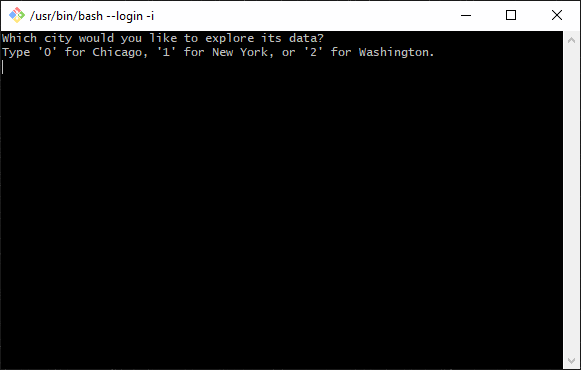

# **US Bikeshare Data**

 In this project, python is used to compute descriptive statistics of data related to bike share systems for three major cities. This [data](https://drive.google.com/file/d/1lhD6W1pDUrWxyddsb6PkDf8I5AMYKLS_/view?usp=sharing) is provided by [Motivate](https://www.motivateco.com/), a bike share system provider for many major cities in the United States of America.

The original files were much larger and messier, but they can be accessed here ([Chicago](https://ride.divvybikes.com/system-data), [New York City](https://ride.citibikenyc.com/system-data), [Washington](https://www.capitalbikeshare.com/system-data)). Some data wrangling has been performed to condense these files into **6** core columns;

 

> First 10 rows of the **new_york_city.csv** file.

 

> The program takes raw input to create an interactive experience in the terminal to present these statistics.

 

### **Statistics Computed**

Popular times of travel;
- Most common month.
- Most common day of week.
- Most common hour of day.

Popular stations and trip;
- Most common start station.
- Most common end station.
- Most common trip (combination of start station and end station).

Trip durations;
- Total travel time.
- Average travel time.

Users information;
- Counts of each user type (subscribers and customers). 
- Counts of each gender. (NYC and Chicago only)
- The earliest, most recent, and most common year of birth. (NYC and Chicago only)